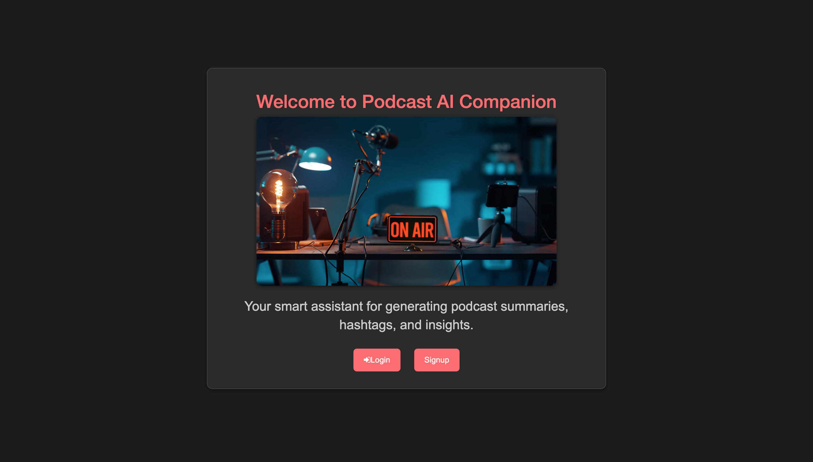

# MyPod AI Companion 🎙

### Description
User can Login/Sign up to make an account to the MyPod AI Companion app where they can take their podcast transcript and paste it into the app to give them a summarized version of their whole podcast to uplaod. The user also will have their summaries saved and can see all of their past summaries to never lose them.

### Tech Used:

- HTML
- CSS
- Javascript
- MongoDB
- Node.js

### Lessons Learned:
- How to create and manage a database collection with MongoDB
- How to set up an Express server and define routes for different pages
- How to handle form inputs and pass data from the frontend to the backend
- Integrate API responses into a MongoDB-powered web app

## Installation

1. Clone repo
2. run `npm install`

## Usage

1. run `node server.js`
2. Navigate to `localhost:8080`

## Credit

Modified from Scotch.io's auth tutorial
